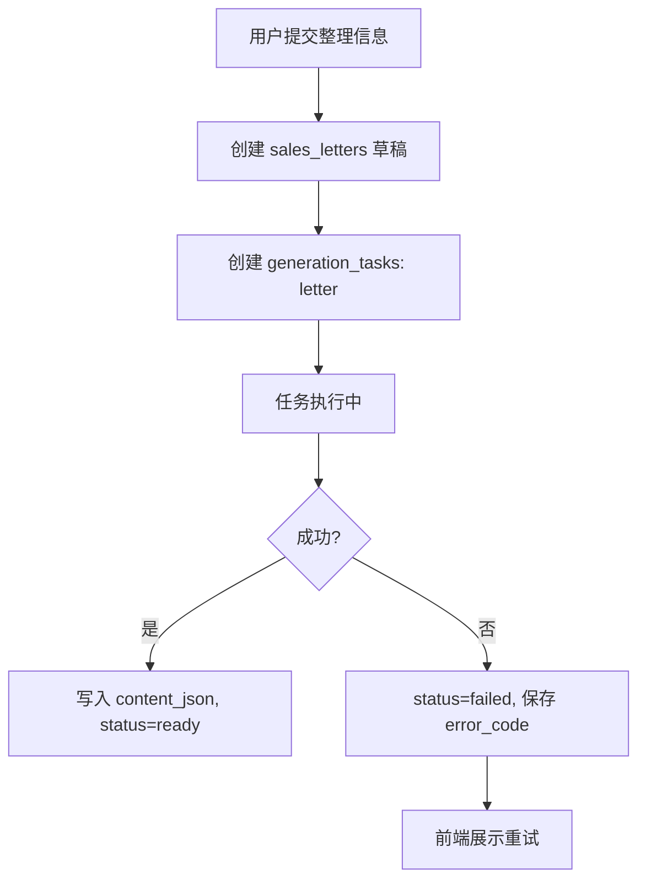

# 异步任务链路 v0.1

日期：2026-05-26

## 目标

销售信生成、语音处理、PDF 导出都按任务化处理，前端不依赖一次同步请求等待完成。

## 任务类型

- `voice_transcribe`：语音转文字。
- `letter`：生成销售信。
- `pdf_export`：导出 PDF。

## 通用状态

```text
queued
running
succeeded
failed
cancelled
```

## 前端流程

1. 用户完成通话信息。
2. 前端 `POST /api/tasks` 创建任务。
3. 页面进入生成中状态。
4. 前端轮询 `GET /api/tasks/:id`。
5. 成功后跳转销售信详情页。
6. 失败时保留已采集信息，允许重试。

## 销售信生成



## 语音处理

一期 H5 可先不接真实语音上传。正式接入时：

- 前端上传音频文件。
- 服务端创建 `files` 记录。
- 创建 `voice_transcribe` 任务。
- 识别结果追加进 `sales_letters.input_json`。

## PDF 导出

导出不应阻塞前端：

1. `POST /api/letters/:id/export-pdf`
2. 服务端创建 `pdf_export` 任务。
3. 成功后写入 `files` 表。
4. 前端拿到下载地址或文件状态。

## 失败恢复

- 任务失败不能删除 `sales_letters.input_json`。
- 相同 `letter_id + task_type` 可创建新重试任务，但旧任务保留审计。
- 前端展示失败原因时只给用户可理解文案，不暴露服务端细节。

## 轮询建议

```text
0-10 秒：每 1 秒
10-60 秒：每 3 秒
60 秒后：每 8 秒，并提示可稍后回来
```

任务结果必须可恢复：用户刷新页面后，通过 `letter_id` 或 `task_id` 找回进度。
