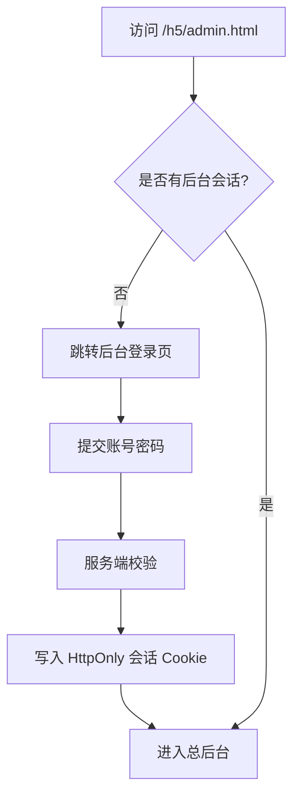

# 总后台登录与权限 v0.1

日期：2026-05-27

## 目标

在 H5 总后台公网部署前，先补最小登录和权限边界，避免 `h5/admin.html` 裸露后被任意访问配置、订单和权益页面。

## 当前状态

当前 `h5/admin.html` 是本地 mock 总后台，所有配置保存在同源 `localStorage.xiabiAdminConfig`。它适合本地验证，不适合直接作为公网后台。

## 最小角色

### owner

- 管理首页文案、通话引导、模板、价格权益。
- 查看用户、销售信、订单、权益流水、日志。
- 触发订单补偿查询和配置发布。

### operator

- 查看用户、销售信、订单和反馈。
- 不可修改价格、支付入口、权益规则。

### viewer

- 只读查看概览、订单、权益和日志。

## 登录流程



## 后台 API

```text
POST /api/admin/login
POST /api/admin/logout
GET /api/admin/me
GET /api/admin/config
PATCH /api/admin/config
GET /api/admin/orders
GET /api/admin/entitlements
GET /api/admin/logs
```

## 安全要求

- 后台登录态使用 HttpOnly Cookie，不把后台 token 存在 `localStorage`。
- 账号密码只传 HTTPS。
- 密码服务端哈希保存，不保存明文。
- 敏感操作写 `audit_log`。
- 价格、支付入口、权益规则修改只允许 owner。
- 登录失败做限流，避免公网暴力尝试。

## 公网部署前拦截策略

在真实登录完成前，有两个安全选择：

1. 只部署用户端，不部署 `h5/admin.html`。
2. 部署后台但由平台访问控制保护，例如只允许指定账号或指定 IP 访问。

推荐先选第 1 种。等后台登录 API 完成后，再开放总后台公网地址。
