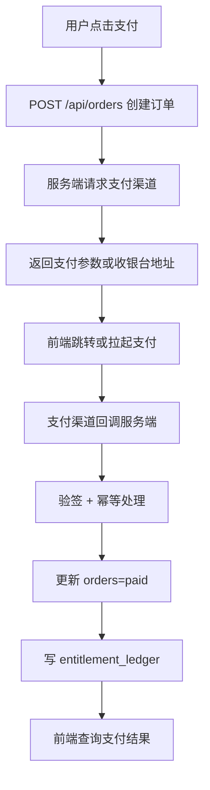

# 正式支付链路 v0.1

日期：2026-05-26

## 目标

把当前 H5 mock 支付替换为 Web/Edgespark.dev 可用的真实支付链路。不要默认使用微信小程序专用支付 API。

## 商品

- `single_unlock`：单封解锁。
- `annual_membership`：年卡会员。

## 支付流程



## 幂等规则

- `orders.order_no` 唯一。
- `payment_webhook_events.event_id` 唯一。
- 同一订单重复回调只能更新一次 `paid_at`。
- `entitlement_ledger` 对同一 `order_id + entitlement_type` 设置唯一约束。
- 回调处理失败可以重试，但不能重复发权益。

## 创建订单

```text
POST /api/orders
```

请求：

```json
{
  "tenant_id": "default",
  "product_type": "annual_membership",
  "letter_id": "optional"
}
```

响应：

```json
{
  "order_id": "ord_xxx",
  "order_no": "202605260001",
  "amount_cent": 200000,
  "provider": "wechat",
  "payment_url": "https://...",
  "expires_at": "2026-05-26T12:30:00+08:00"
}
```

金额必须由服务端配置计算，不能信任前端传入。

## 回调处理

```text
POST /api/payments/webhook
```

处理步骤：

1. 保存原始回调到 `payment_webhook_events`。
2. 验签。
3. 根据 `order_no` 查询订单。
4. 若订单已支付，标记事件为 `ignored`。
5. 若订单未支付，更新订单为 `paid`。
6. 写入权益流水。
7. 返回渠道要求的成功响应。

## 权益发放

`single_unlock`：

- 写 `entitlement_ledger.entitlement_type=single_letter`
- 必须绑定 `letter_id`
- 只解锁当前信件

`annual_membership`：

- 写 `entitlement_ledger.entitlement_type=annual_membership`
- 设置 `effective_at` 和 `expires_at`
- 用户端用 `GET /api/entitlements` 判断当前权益

## 前端查询

支付完成后前端不直接相信跳转结果：

```text
GET /api/orders/:id/payment-status
GET /api/entitlements
```

只有服务端返回 `paid` 且权益流水生效，用户端才展示“已开通/已解锁”。

## 当前 mock 到正式支付的替换点

```text
addMockPayment(...) -> POST /api/orders
h5MockOrders -> GET /api/orders
h5MockLedger -> GET /api/entitlements
annual-pay/mock-pay action -> create order + poll status
```
